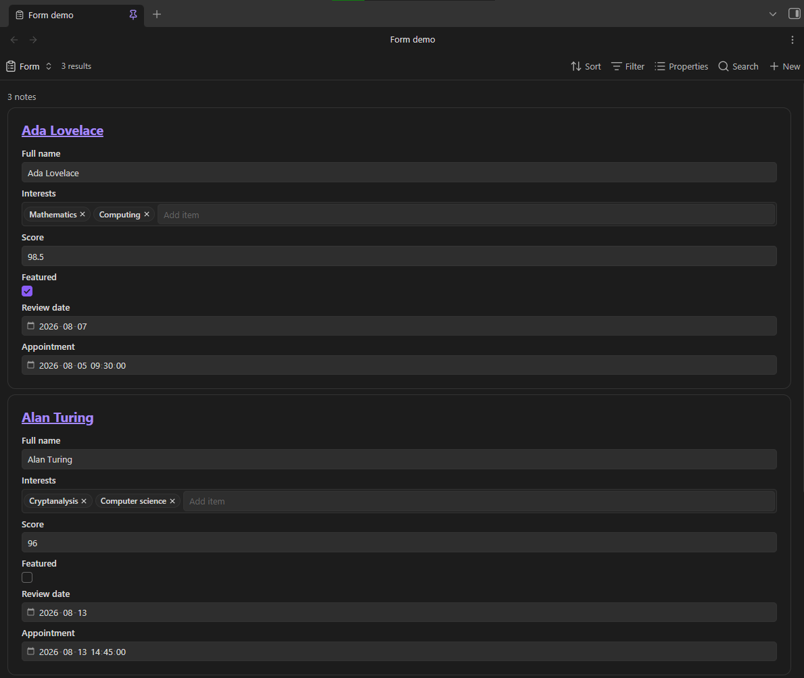
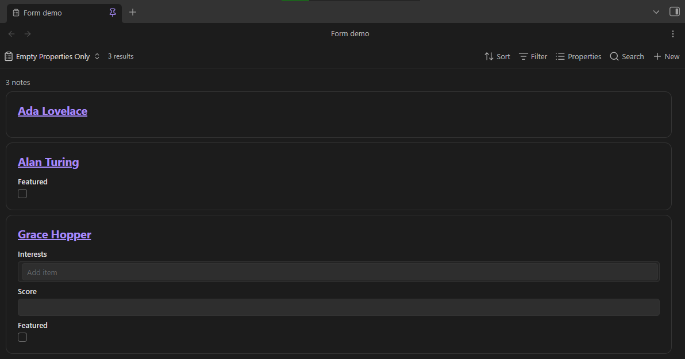
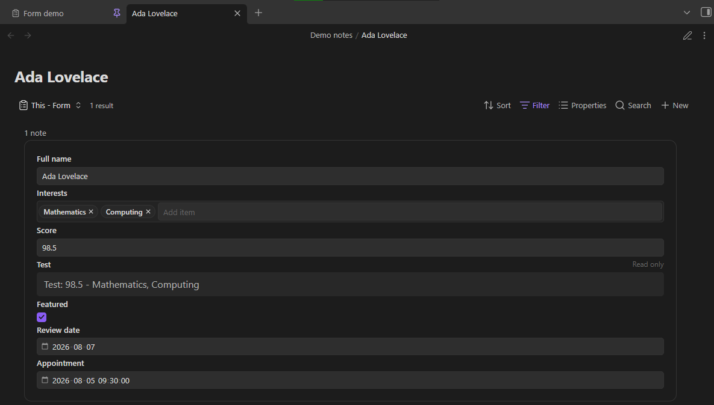

# BaseForm

[](https://github.com/TylerCarrol/obsidian-base-form/releases/latest) [](https://github.com/TylerCarrol/obsidian-base-form/blob/main/LICENSE) [](https://github.com/TylerCarrol/obsidian-base-form/actions/workflows/lint.yml) [](https://github.com/TylerCarrol/obsidian-base-form/actions/workflows/test.yml)
[](https://buymeacoffee.com/tylercarrol)

BaseForm adds an editable **Form** view to [Obsidian Bases](https://help.obsidian.md/bases). Each note is displayed as an interactable form, with the selected properties stacked vertically.

## Features

- Edit text, list, number, checkbox, date, and date-and-time properties.
- Autocomplete in text and list fields.
- Save changes directly to note frontmatter with Obsidian's file API.
- Use the property order and display names set in the Bases toolbar.
- Show each matching note as its own form.
- Control file name visibility, empty-only fields, existing-only fields, and item spacing for each Form view.
- Show file and formula properties as read-only values.
- Run locally on desktop and mobile, with no external services.

## Examples







## Requirements

- Obsidian 1.13.0 or later.
- The **Bases** core plugin must be enabled.

## Use

1. Install and enable BaseForm.
2. Open or create a `.base` file.
3. Add a view, then select **Form**.
4. Use **Properties** in the Bases toolbar to choose and reorder the form fields.
5. Use the view options to show or hide file names, show only empty property inputs, show only existing property inputs, and adjust item spacing.
6. Edit a field, then move focus away from it to save the value.

List fields use one item per line. If you clear a number, date, or date-and-time field, BaseForm keeps the property with an empty value. File and formula properties stay visible, but you cannot edit them.

BaseForm uses Obsidian's assigned property types when they are available. If an untyped property is empty in every matching note, BaseForm first uses a text field.

BaseForm shows some values as read-only to prevent accidental data loss. This includes nested data, non-text lists, and date-and-time values with timezone suffixes.

## Demo vault

The repository includes `base-form-demo-vault`. It contains a configured base and sample notes for every supported property type. See [`base-form-demo-vault/README.md`](base-form-demo-vault/README.md) for the walkthrough.

## Install for development

1. Install dependencies:
   ```bash
   npm install
   ```
2. Build the plugin:
   ```bash
   npm run build
   ```
3. Copy `main.js`, `manifest.json`, and `styles.css` to:
   ```text
   <Vault>/.obsidian/plugins/base-form/
   ```
4. Enable **Settings → Community plugins → BaseForm**.

For watch mode, run `npm run dev`. On Windows, `./scripts/build-to-demo-vault.ps1` builds the plugin and installs it into the included demo vault.

## Validate changes

```bash
npm run lint
npm test
npm run build
```

## Privacy

BaseForm runs locally. It does not make network requests, collect analytics, or send vault data anywhere.
